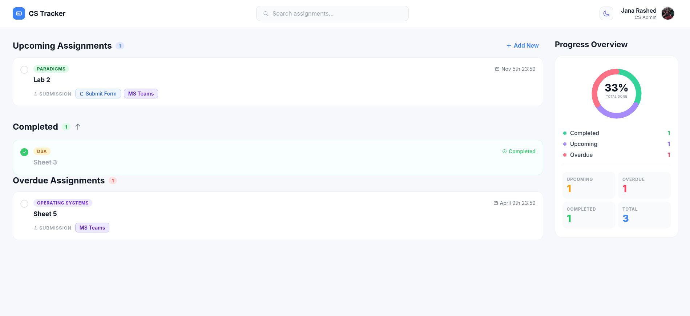
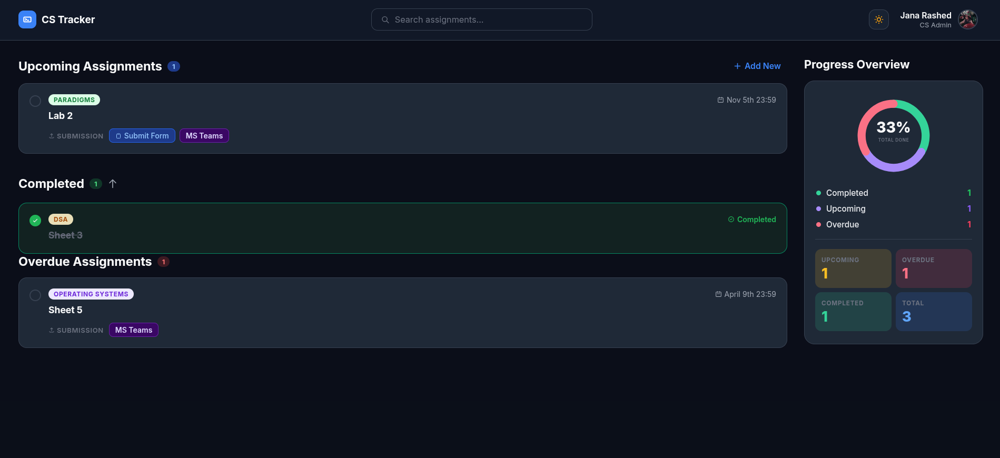

<div align="center">

# CS Assignment Tracker

**A web app for CS students to track assignments, deadlines, and progress — with admin tools, dark mode, and a real-time progress overview.**


**[Live Demo](https://janamirashed.github.io/cs-assignment-tracker/)**

</div>

---

## Overview

CS Tracker keeps all assignments in one place — sorted by urgency into Upcoming, Overdue, and Completed sections. A progress donut chart gives an instant read on how many assignments are done vs pending. Admins can add and manage assignments through a simple form. The app supports both light and dark mode and is fully deployed on GitHub Pages.

---

## Screenshots

<div align="center">
  
  
</div>

---

## Features

- Assignments grouped into Upcoming, Overdue, and Completed sections
- Progress donut chart with live counts per category
- Admin form to add and manage assignments
- Assignments sorted by due date
- Persistent dark / light mode toggle
- Search bar for quick assignment lookup
- Deployed on GitHub Pages with backend on Hugging Face Spaces

---

## Tech Stack

| Layer | Technology |
|-------|------------|
| Frontend | Angular, TypeScript, CSS |
| Backend | Java 17, Spring Boot |
| Deployment | GitHub Pages (frontend), Hugging Face Spaces (backend) |

---

## Running Locally

**Prerequisites:** Java 17+, Maven, Node.js 18+

**Backend**
```bash
cd backend
./mvnw spring-boot:run
```

**Frontend**
```bash
cd frontend
npm install
ng serve
```
App available at `http://localhost:4200`

---

## Author

Jana Rashed — [GitHub](https://github.com/janamirashed) · [LinkedIn](https://www.linkedin.com/in/jana-rashed/) · [Portfolio](https://janamirashed.github.io/my-portfolio/)
