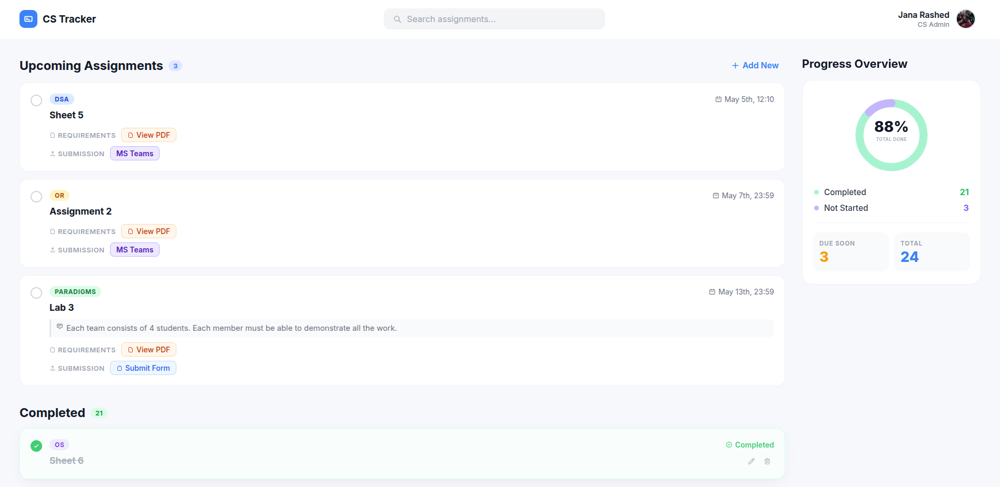

# CS Assignment Tracker

A simple, clean app that helps CS students track and manage their assignments in one place.

## The Vision

This project combines the ease of a Google Sheet with the power of a web app. It's designed to make assignment tracking less stressful and more straightforward—no complicated menus or confusing buttons.

## Built For Everyone
  
**For Admins:**
Adding new assignments and updating deadlines is quick and easy. Just fill out a simple form and you're done—no complicated systems to learn.

**For Students:**
See all your assignments in one place, organized by due date. Mark them off as you complete them and watch your progress grow.

## Key Features

- **Track Progress:** Mark assignments as complete and see your progress at a glance.
- **Admin Tools:** Simple forms to add and manage assignments.
- **Organized by Date:** Assignments are sorted by due date so you see what's due soonest first.
- **Clean Design:** A modern, easy-to-use interface that looks good and works smoothly.

## Tech Stack

- **Frontend:** Angular, HTML, CSS
- **Backend:** Spring Boot (Java)
- **Deployment:** GitHub Pages (Frontend) & Hugging Face Spaces (Backend)